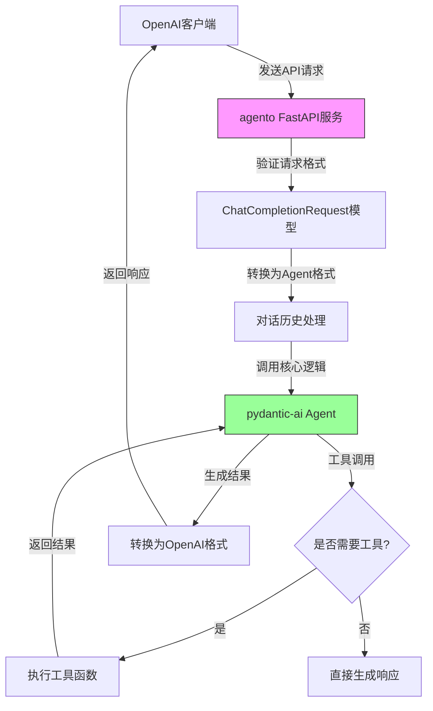

# 介绍agento：将Pydantic-AI Agent转换为OpenAI兼容API服务

## 什么是agento？

agento是一个创新的Python工具，它能够将pydantic-ai agent封装成符合OpenAI API标准的大模型服务。这意味着任何现有的OpenAI客户端库都可以无缝对接pydantic-ai agent，让开发者能够轻松地将强大的Agent能力集成到他们的应用中。

## 核心功能与优势

- **OpenAI API兼容性**：实现了`/v1/chat/completions`和`/v1/models`等核心端点，完全符合OpenAI API规范
- **流式响应支持**：同时支持流式和非流式两种响应模式
- **简单易用**：单文件FastAPI应用，配置简单，部署方便
- **灵活性**：可通过环境变量轻松配置后端模型

## 技术架构

agento采用简洁而强大的架构设计：

1. **FastAPI基础**：使用FastAPI构建高性能RESTful API服务
2. **Pydantic模型**：定义了与OpenAI API兼容的数据模型（ChatMessage、ChatCompletionRequest等）
3. **Agent封装**：通过LLMWrapper类将pydantic-ai Agent与API端点绑定
4. **异步处理**：支持异步请求处理，提高并发性能

### 工作流程图解

以下mermaid流程图展示了agento的核心工作原理：



## 核心代码解析

### Agent初始化

在`main.py`中，我们可以看到Agent的初始化过程：

```python
model = OpenAIModel(
    model_name,
    provider=OpenAIProvider(
        base_url=base_url,
        api_key=api_key,
    ),
)
agent = Agent(
    model,
    instructions='You are a helpful assistant.',
)
```

### 工具定义

agento支持工具调用功能，示例中定义了获取当前时间的工具：

```python
@agent.tool_plain
def get_current_time() -> datetime:
    return datetime.now()
```

### API端点实现

在`agento/__init__.py`中，定义了主要API端点：

- `GET /`：健康检查端点
- `GET /v1/models`：返回可用模型列表
- `POST /v1/chat/completions`：处理聊天补全请求

特别是聊天补全端点，支持流式响应：

```python
async def create_chat_completion(self, request: ChatCompletionRequest):
    if request.stream:
        return StreamingResponse(
            self.stream_chat_response(request, conversation),
            media_type="text/event-stream"
        )
    else:
        return await self.generate_chat_response(request, conversation)
```

## 快速开始

### 环境要求
- Python >= 3.11
- 依赖：FastAPI, uvicorn, pydantic, pydantic-ai

### 安装与配置

```bash
# 使用uv安装依赖
uv pip install -e .

# 创建.env文件设置环境变量
BASE_URL=your_api_base_url
API_KEY=your_api_key
MODEL_NAME=your_model_name
```

### 运行服务

```bash
# 直接运行
python main.py

# 或使用uvicorn
uvicorn main:app --host 0.0.0.0 --port 8000 --reload
```

### API测试

```bash
# 查看模型列表
curl http://localhost:8000/v1/models

# 测试聊天补全
curl -X POST http://localhost:8000/v1/chat/completions \
  -H "Content-Type: application/json" \
  -d '{"model": "pydantic-ai-agent", "messages": [{"role": "user", "content": "Hello!"}]}'
```

## 结语

agento为pydantic-ai agent提供了一个强大的接口转换层，使得Agent能够像传统大模型一样被轻松接入。这种设计不仅保留了Agent的工具调用和复杂任务处理能力，还充分利用了现有的OpenAI生态系统，为开发者提供了极大的便利。

无论是构建智能助手、自动化工作流还是复杂的AI应用，agento都能成为连接pydantic-ai Agent与实际应用的理想桥梁。